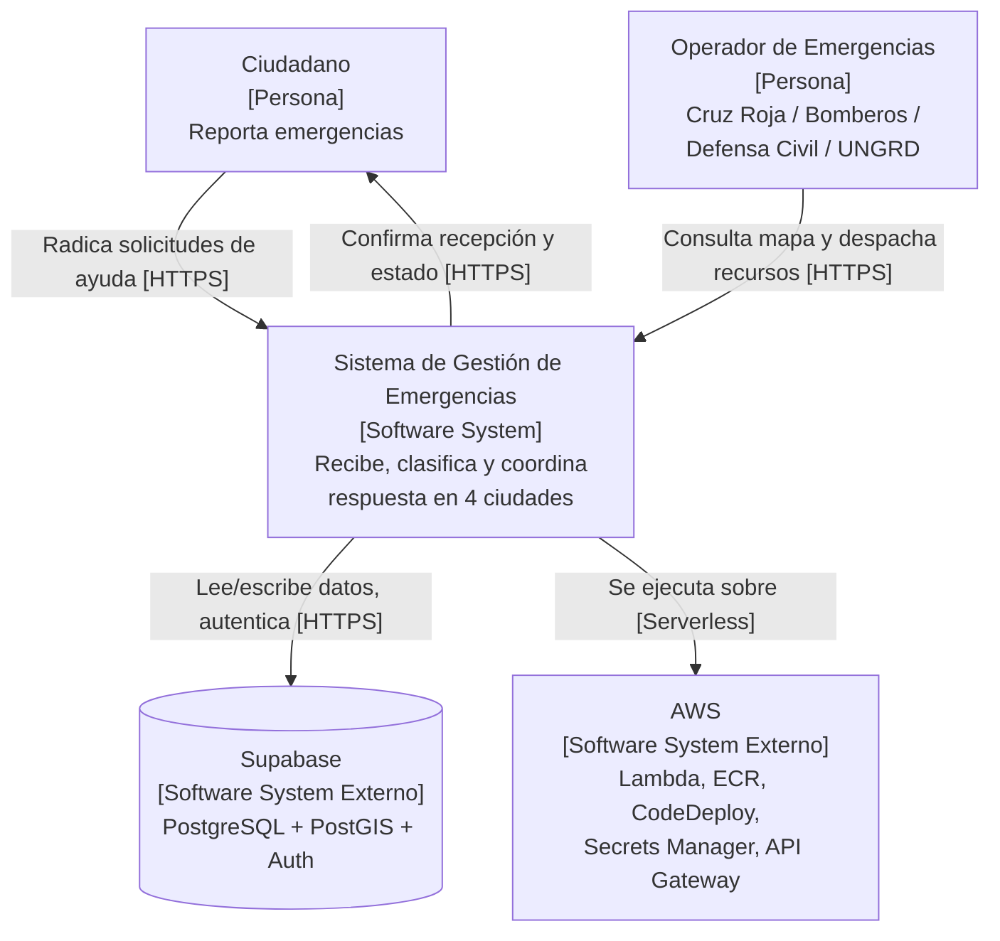
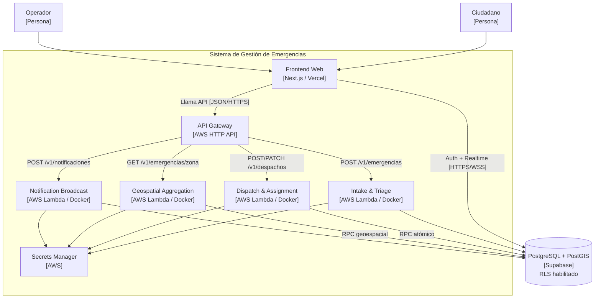
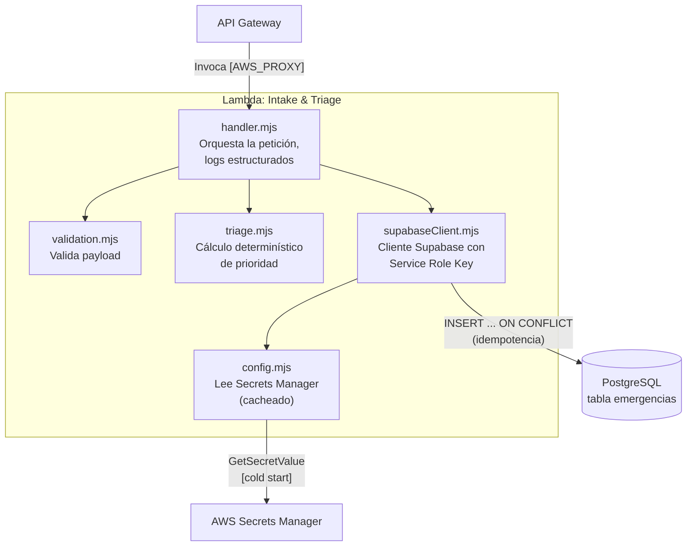
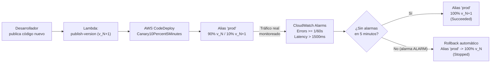

# Sistema de Gestión de Emergencias — Chocó, Pereira, Cali, Manizales

Arquitectura de Microservicios Serverless Resiliente para Gestión de
Emergencias — Parcial 1, curso **Patrones Arquitectónicos Avanzados**.

---

## Tabla de contenido

1. [Contexto y Objetivo](#1-contexto-y-objetivo)
2. [Arquitectura de Software (Modelo C4)](#2-arquitectura-de-software-modelo-c4)
3. [Descomposición de Microservicios](#3-descomposición-de-microservicios)
4. [Persistencia de Datos y Seguridad (Supabase)](#4-persistencia-de-datos-y-seguridad-supabase)
5. [Gestión de Secretos y Seguridad](#5-gestión-de-secretos-y-seguridad)
6. [API Gateway](#6-api-gateway)
7. [Estrategia de Despliegue Progresivo — Canary](#7-estrategia-de-despliegue-progresivo--canary)
8. [Gobernanza de Costos (AWS Budgets)](#8-gobernanza-de-costos-aws-budgets)
9. [Manual de Despliegue](#9-manual-de-despliegue)
10. [Lecciones de Arquitectura e Incidentes Resueltos](#10-lecciones-de-arquitectura-e-incidentes-resueltos)
11. [Frontend Web (Next.js / Vercel)](#11-frontend-web-nextjs--vercel)
12. [Conclusiones](#12-conclusiones)

---

## 1. Contexto y Objetivo

En 2026, un evento sísmico de alta magnitud afectó de forma crítica a
Chocó, Pereira, Cali y Manizales. La infraestructura convencional de
telecomunicaciones y despacho de emergencias colapsó por picos masivos
de tráfico concurrente, solicitudes duplicadas y falta de resiliencia
en el procesamiento geoespacial.

Este repositorio contiene la arquitectura de software implementada
para resolver ese problema: una plataforma **serverless**, desacoplada
en microservicios contenerizados, capaz de recibir, clasificar
(triage), despachar recursos y notificar actualizaciones de estado a
ciudadanos y organismos de socorro — con mecanismos explícitos de
resiliencia (idempotencia, Row Level Security, despliegue progresivo
con rollback automático).

---

## 2. Arquitectura de Software (Modelo C4)

### 2.1. Diagrama de Contexto

Muestra el sistema como una caja negra y sus interacciones con los
usuarios (ciudadanos, operadores) y sistemas externos (Supabase, AWS).



### 2.2. Diagrama de Contenedores

Descompone el sistema en sus piezas desplegables de forma
independiente: el frontend, el API Gateway, los 4 microservicios
Lambda, el gestor de secretos, y la base de datos.



### 2.3. Diagrama de Componentes — Intake & Triage

Estructura interna del microservicio más representativo, mostrando
cómo se separan las responsabilidades de validación, lógica de negocio
(triage determinístico), y acceso a datos/secretos.



---

## 3. Descomposición de Microservicios

Los cuatro microservicios son completamente autónomos: cada uno tiene
su propio `Dockerfile`, su propio secreto en Secrets Manager, su
propio rol IAM de mínimo privilegio, y su propio ciclo de despliegue
(versión + alias + Deployment Group de CodeDeploy).

### 3.1. Intake & Triage

Recibe reportes ciudadanos, valida el payload, calcula la prioridad de
atención (P1–P4) mediante una regla **determinística** (no
probabilística/IA), y persiste la emergencia con protección de
idempotencia (`idempotency_key` único) para evitar duplicados bajo
picos de tráfico.

**Regla de priorización:**

| Tipo de solicitud | Prioridad base | Reglas de escalamiento |
|---|---|---|
| Búsqueda y Rescate / Médica | P1 | Sin escalamiento posible (ya es la máxima) |
| Albergue y Refugio | P2 | Escala a P1 si hay riesgo vital, o menores/adultos mayores sin techo |
| Suministros y Asistencia | P3 | Escala a P2 si son medicamentos crónicos |
| Daños Estructurales | P4 | Escala a P2 si hay riesgo de colapso sobre vía pública |

### 3.2. Dispatch & Assignment

Asigna atómicamente el recurso (cuadrilla) disponible más cercano a
una emergencia, mediante una función de PostgreSQL/PostGIS que usa
`FOR UPDATE SKIP LOCKED`. Esto garantiza que, bajo despachos
concurrentes, dos operaciones nunca asignen la misma cuadrilla dos
veces — una condición de carrera real que se resuelve a nivel de base
de datos, no de aplicación.

### 3.3. Geospatial & Zone Aggregation

Agrupa emergencias activas en clusters geográficos (puntos calientes)
mediante clustering basado en grilla — determinístico y reproducible,
a diferencia de algoritmos como k-means. Adicionalmente, detecta
"zonas aisladas": emergencias activas sin ningún recurso disponible
dentro de un radio de 5 km.

### 3.4. Notification & Status Broadcast

Transmite el estado de una emergencia a sistemas externos (organismos
de socorro) vía webhooks HTTP con timeout controlado. Registra cada
intento —exitoso o fallido— en la tabla `notificaciones`. Un webhook
caído no afecta el envío a los demás destinatarios ni la respuesta
general del servicio.

---

## 4. Persistencia de Datos y Seguridad (Supabase)

### 4.1. Modelo de datos

PostgreSQL con la extensión **PostGIS** habilitada. Las tablas
principales son: `usuarios`, `zonas`, `emergencias`, `recursos`,
`despachos` y `notificaciones`. Las coordenadas se almacenan como
`geography(Point, 4326)`, permitiendo cálculos reales de distancia
(`ST_Distance`, `ST_DWithin`) usados por Dispatch y Geospatial.

### 4.2. Row Level Security (RLS)

Todas las tablas de negocio tienen RLS habilitado. Las políticas
garantizan:

- Un ciudadano solo ve y crea sus propias emergencias
  (`creado_por = auth.uid()`).
- Un operador solo ve y actualiza emergencias de su ciudad asignada.
- Se usan funciones `SECURITY DEFINER` (`rol_actual()`,
  `ciudad_asignada_actual()`) para evitar recursión infinita al
  consultar la tabla de perfiles desde las propias políticas.

**Validación:** se crearon usuarios de prueba de cada rol, se
autenticaron con sus JWT reales contra la API de Supabase, y se
confirmó que cada uno solo podía ver los datos permitidos por sus
políticas — no solo se revisó la configuración, se probó el
comportamiento real.

### 4.3. Supabase Realtime

El dashboard de operadores se suscribe a cambios en la tabla
`emergencias` vía `postgres_changes`, actualizando la vista sin
necesidad de polling — cumpliendo el requisito de actualización
reactiva del enunciado.

---

## 5. Gestión de Secretos y Seguridad

Restricción aplicada de forma estricta: **ningún archivo `.env`,
credencial, o llave de API existe en el repositorio de código**, ni
siquiera en el historial de commits.

### 5.1. AWS Secrets Manager

Cada microservicio tiene su propio secreto (por ejemplo,
`emergencias/intake-triage`) con la URL y Service Role Key de
Supabase. El cliente lee el secreto en tiempo de cold start y lo
cachea en memoria para invocaciones subsecuentes ("warm"), evitando
llamadas repetidas a Secrets Manager.

### 5.2. IAM de mínimo privilegio

Cada Lambda tiene un rol de ejecución exclusivo con exactamente dos
permisos: escribir logs en CloudWatch, y leer únicamente su propio
secreto (el `Resource` del permiso apunta al ARN específico del
secreto, no a un comodín). Esto se verificó explícitamente
inspeccionando la política adjunta a cada rol.

### 5.3. Frontend

El cliente web utiliza exclusivamente el `anon key` público de
Supabase. La Service Role Key jamás se expone al navegador; la
seguridad real de los datos recae en las políticas RLS del backend, no
en mantener en secreto las credenciales del cliente.

---

## 6. API Gateway

Se configuró un HTTP API de AWS (más liviano que un REST API
tradicional) como punto único de entrada, publicado en el stage
`prod`, con throttling configurado (10 req/s, ráfaga de 20) y CORS.

| Método | Ruta | Microservicio |
|---|---|---|
| POST | `/v1/emergencias` | Intake & Triage |
| GET | `/v1/emergencias/zona/{ciudad}` | Geospatial & Zone Aggregation |
| POST | `/v1/despachos` | Dispatch & Assignment |
| PATCH | `/v1/despachos/{id}` | Dispatch & Assignment |
| POST | `/v1/notificaciones` | Notification & Broadcast |

> ⚠️ **Nota de seguridad:** el CORS se mantiene abierto (`*`) durante
> el desarrollo del frontend, y debe restringirse al dominio final de
> Vercel antes de la puesta en producción definitiva.

---

## 7. Estrategia de Despliegue Progresivo — Canary

Se eligió **Canary con AWS CodeDeploy y Lambda Aliases** (Opción A del
enunciado) sobre Feature Flags, dado que aprovecha directamente la
infraestructura AWS ya construida sin requerir modificar código de
negocio ya validado.

### 7.1. Componentes construidos

- Versión publicada + alias `"prod"` por cada Lambda (el API Gateway
  invoca el alias, nunca `$LATEST` directamente).
- Dos alarmas de CloudWatch por servicio: errores (≥1 en 60s) y
  latencia (>1500ms, umbral exigido por el enunciado), medidas
  específicamente sobre el alias `prod`.
- Application y Deployment Group en CodeDeploy con configuración
  `CodeDeployDefault.LambdaCanary10Percent5Minutes`: 10% de tráfico
  durante 5 minutos, luego 100% si no hay alarmas activadas.
- Rollback automático habilitado ante `DEPLOYMENT_FAILURE` o
  `DEPLOYMENT_STOP_ON_ALARM`.

### 7.2. Flujo de despliegue



### 7.3. Evidencia de rollback automático — cronología real

Se introdujo un bug intencional en el microservicio Intake & Triage
(una excepción no controlada en el cálculo de prioridad) para validar
el mecanismo de rollback end-to-end.

**Primer intento (hallazgo documentado):** Se lanzó el despliegue sin
generar tráfico real durante la ventana de observación. CodeDeploy,
sin datos de error que evaluar, completó el despliegue al 100%,
dejando el bug activo en producción momentáneamente. Esto reveló una
propiedad importante del patrón: **el Canary depende de tráfico real
(o sintético) durante la ventana de observación** — sin invocaciones,
las alarmas no tienen nada que medir. Se confirmó el problema
invocando el alias directamente y se revirtió manualmente con
`aws lambda update-alias` mientras se preparaba el reintento.

**Segundo intento (éxito):** Se relanzó el despliegue generando
tráfico real contra el API Gateway en paralelo. La alarma de errores
se activó dentro de la ventana de evaluación, y CodeDeploy detuvo el
despliegue automáticamente:

```
Estado del despliegue: InProgress -> Stopped
Alias "prod" verificado -> versión anterior (sana), sin intervención manual
```

Se confirmó posteriormente, mediante invocación directa, que el alias
`prod` había vuelto exactamente a la versión previa a la introducción
del bug, y que el sistema respondía con normalidad.

---

## 8. Gobernanza de Costos (AWS Budgets)

Se configuró un presupuesto mensual con límite fijo de **$10.00 USD**
(`emergencias-colombia-monthly`) y dos alertas por correo electrónico:

- **Alerta 1:** consumo real (*Actual costs*) superior al 50% del
  presupuesto.
- **Alerta 2:** consumo proyectado (*Forecasted costs*) superior al
  85% del presupuesto.

La suscripción a las notificaciones por correo fue confirmada
explícitamente (paso frecuentemente omitido, sin el cual las alertas
nunca llegan aunque el presupuesto esté bien configurado).

---

## 9. Manual de Despliegue

Todo el proceso de aprovisionamiento es reproducible mediante scripts
de PowerShell versionados en `infra/`, sin pasos manuales no
documentados. Todos los scripts son **idempotentes**: detectan si un
recurso ya existe y lo reutilizan en vez de fallar o duplicarlo.

| Script | Función |
|---|---|
| `deploy-service.ps1` | Build de imagen, push a ECR, creación de secreto, rol IAM y función Lambda para un microservicio |
| `setup-api-gateway.ps1` | Crea el API HTTP, integraciones, rutas, stage y CORS |
| `setup-canary-alias.ps1` | Publica versión, crea alias `"prod"`, redirige el API Gateway al alias |
| `setup-canary-alarms.ps1` | Crea las alarmas de CloudWatch (errores y latencia) sobre el alias |
| `setup-codedeploy.ps1` | Crea el rol, Application y Deployment Group de CodeDeploy |
| `deploy-canary.ps1` | Ejecuta un despliegue Canary real, monitoreando el estado en vivo |

### 9.1. Estructura del repositorio

```
.
├── infra/                    Scripts de despliegue (PowerShell)
├── supabase/
│   └── migrations/           Migraciones SQL numeradas (PostgreSQL + PostGIS)
├── services/                 Los 4 microservicios (Node.js ESM, Docker)
│   ├── intake-triage/
│   ├── dispatch-assignment/
│   ├── geospatial-aggregation/
│   └── notification-broadcast/
└── Frontend/                 Frontend web (Next.js / Vercel)
```

Cada microservicio sigue la misma estructura interna: `src/handler.mjs`
(punto de entrada Lambda), `src/config.mjs` (lee secretos desde AWS
Secrets Manager), `src/supabaseClient.mjs`, `src/validation.mjs`, más
un archivo de lógica de negocio propio, y una carpeta `test/` con
pruebas locales.

### 9.2. Orden de despliegue desde cero

1. **Base de datos**: aplicar las migraciones SQL en Supabase (carpeta
   `supabase/migrations/`, en orden numérico).
2. **Microservicios**: ejecutar `deploy-service.ps1` para cada uno de
   los 4 microservicios, cada uno con su propio `secret.json` local
   (no versionado) con la URL y Service Role Key de Supabase.
3. **API Gateway**: ejecutar `setup-api-gateway.ps1`.
4. **Despliegue progresivo (opcional/demostrativo)**: ejecutar
   `setup-canary-alias.ps1`, `setup-canary-alarms.ps1` y
   `setup-codedeploy.ps1` por servicio, y luego `deploy-canary.ps1`.
5. **Gobernanza de costos**: configurar AWS Budgets desde la consola.
6. **Frontend**: desplegar `Frontend/` en Vercel, configurando las
   variables de entorno del API Gateway y Supabase.

Ningún archivo `.env`, `secret.json` o credencial vive en este
repositorio — todos los secretos se leen dinámicamente desde AWS
Secrets Manager en tiempo de ejecución.

---

## 10. Lecciones de Arquitectura e Incidentes Resueltos

Se documentan aquí los hallazgos técnicos reales encontrados durante
la construcción, por su valor como evidencia de comprensión profunda
del sistema (no solo ejecución de comandos).

### 10.1. Las versiones de Lambda son inmutables

Un cambio de configuración (por ejemplo, aumentar el timeout) **no**
afecta versiones ya publicadas. El alias `"prod"` sigue apuntando a la
versión antigua hasta que se publica una nueva versión y se mueve el
alias explícitamente — el mismo ciclo que un cambio de código. Esto se
descubrió al aumentar el timeout de Geospatial Aggregation de 15 a 30
segundos: la Lambda seguía fallando por timeout hasta completar ese
ciclo.

### 10.2. Revertir un alias no revierte el código fuente

Durante la demostración de rollback, revertir el alias `"prod"` a la
versión anterior fue una mitigación inmediata correcta, pero el bug
seguía presente en el archivo fuente. Al publicar una versión nueva
por otro motivo (ajuste de timeout), el bug "resucitó" en la nueva
versión. **Lección aplicada:** un rollback de infraestructura y una
corrección de código son dos acciones independientes que deben
completarse ambas.

### 10.3. El Canary requiere tráfico real durante la ventana de observación

Sin invocaciones activas contra el alias durante los 5 minutos de
observación, CodeDeploy no tiene datos que evaluar y avanza el
despliegue al 100% igualmente. La estrategia Canary no es una
protección pasiva: requiere que el sistema esté efectivamente en uso
(o se simule tráfico) para que las alarmas puedan cumplir su función.

### 10.4. Permisos de API Gateway hacia Lambda con Alias

El patrón `SourceArn` para autorizar a API Gateway a invocar una
Lambda requiere **tres comodines** (`api-id/*/*/*`) correspondientes a
etapa, método y ruta. Un patrón con solo dos comodines resulta en
invocaciones fallidas con `"Internal Server Error"`, un error genérico
que no señala la causa real — diagnosticado comparando la invocación
directa (exitosa) contra la invocación vía Gateway (fallida).

---

## 11. Frontend Web (Next.js / Vercel)

> **[Sección a completar por el equipo de frontend]**

Esta sección debe describir la implementación del frontend: stack
utilizado (Next.js sobre Vercel), la vista de radicación de
emergencias para ciudadanos, el panel de operadores con mapa en tiempo
real (Supabase Realtime), y la integración con el API Gateway.

Contenido sugerido a incluir:

- Descripción de la vista de radicación de emergencias (`/reportar`).
- Descripción del panel de operadores (`/dashboard`) con el mapa
  interactivo.
- Cómo se conecta el frontend al API Gateway (variables de entorno,
  CORS).
- Cómo funciona la suscripción a Supabase Realtime para actualización
  en vivo.
- URL de producción del frontend desplegado en Vercel.

---

## 12. Conclusiones

La arquitectura implementada cumple los objetivos de aprendizaje del
taller: microservicios containerizados desacoplados y autónomos,
despliegue serverless en AWS Lambda, persistencia geoespacial con
seguridad a nivel de fila, gestión dinámica de secretos sin variables
de entorno estáticas, y una estrategia de despliegue progresivo con
rollback automático demostrado en producción real — no solo
configurado, sino ejercitado con un fallo real y observado revertirse
sin intervención manual.

El desarrollo incluyó troubleshooting genuino (migraciones de cuenta
AWS, permisos IAM incrementales, timeouts, inmutabilidad de versiones)
documentado como evidencia de comprensión arquitectónica, no solo de
ejecución de instrucciones.

---

*Documentación complementaria con diagramas exportados como imagen y
capturas de evidencia disponible en el informe técnico entregado por
separado.*
